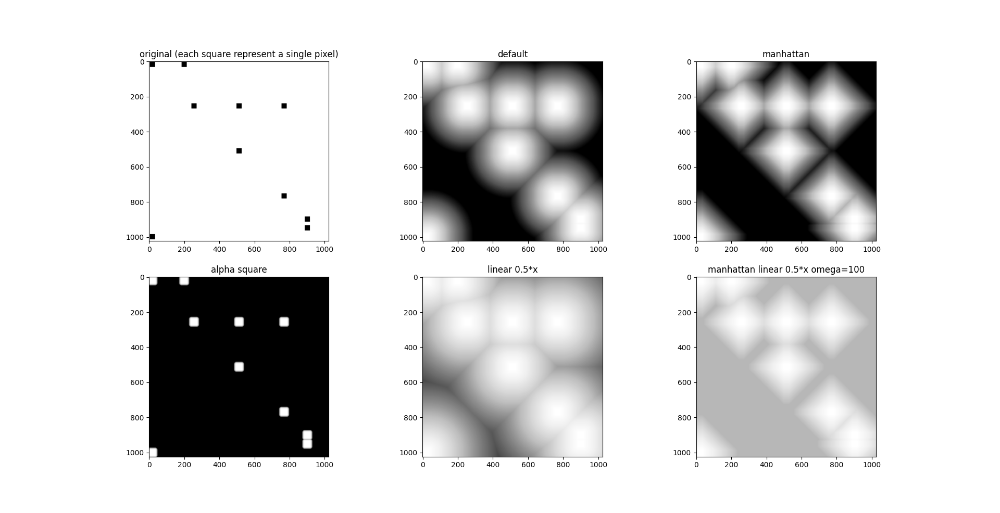
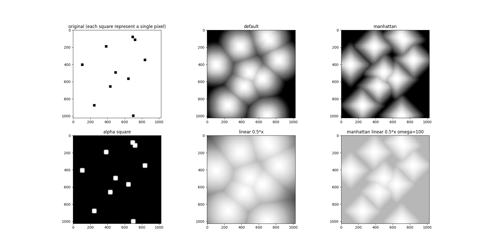

# DistanceMap
Python Distance Map library

For a N-dimension (2 ≤ N ≤ 3) binary matrix, return the corresponding distance map.
For each pixel, the value is equal to the minimum distance to a "positive" pixel.
Due to the way I plan to use this library, the implementation is in reality articulate
over a list of positive points positions and not a binary matrix.

```
Δ = distance to nearest positive point
α = a user defined function (ℝ+ → ℝ+) (default : x ↦ x)
Ω = the maximum value

P_result(x, y) = min(α(Δ), Ω)
```

### Examples



### Usage
Input is a list of positive points

```
distance_map(input.shape, points)
```

Input is binary (boolean) matrix

```
distance_map_from_binary_matrix(input)
```

Input is a list of positive points and you want to use custom arguments

```
distance_map(input.shape, points, distance="manhattan", beta=15.0, alpha="square")
```


Parameters
* Distance
  * euclidean
  * manhattan
* Alpha
  * identity (x ↦ x)
  * square (x ↦ x*x)
  * linear (x ↦ A*x + B)
    * use set_a(a) and def set_b(b) to change A and B values

### Benchmark
The following tests has been made on a laptop with an Intel Core i7-7700HQ and 24Go of RAM.

| Test | Time distance_map | Time distance_map_from_binary_matrix |
|---------------------------------------------------|------|------|
| 2D 1024 x 1024 image with 10 positive points      |  8ms | 11ms |
| 2D 1024 x 1024 image with  5 positive points      |  5ms |  9ms |
| 3D 128 x 128 x 128 image with 10 positive points  | 61ms |148ms |

### Acknowledgement
This library is inspired for use as in the following paper.
```
N. Xu, B. Price, S. Cohen, J. Yang and T. Huang
"Deep Interactive Object Selection"
2016 IEEE Conference on Computer Vision and Pattern Recognition (CVPR)
Las Vegas, NV, 2016, pp. 373-381
doi: 10.1109/CVPR.2016.47
```
